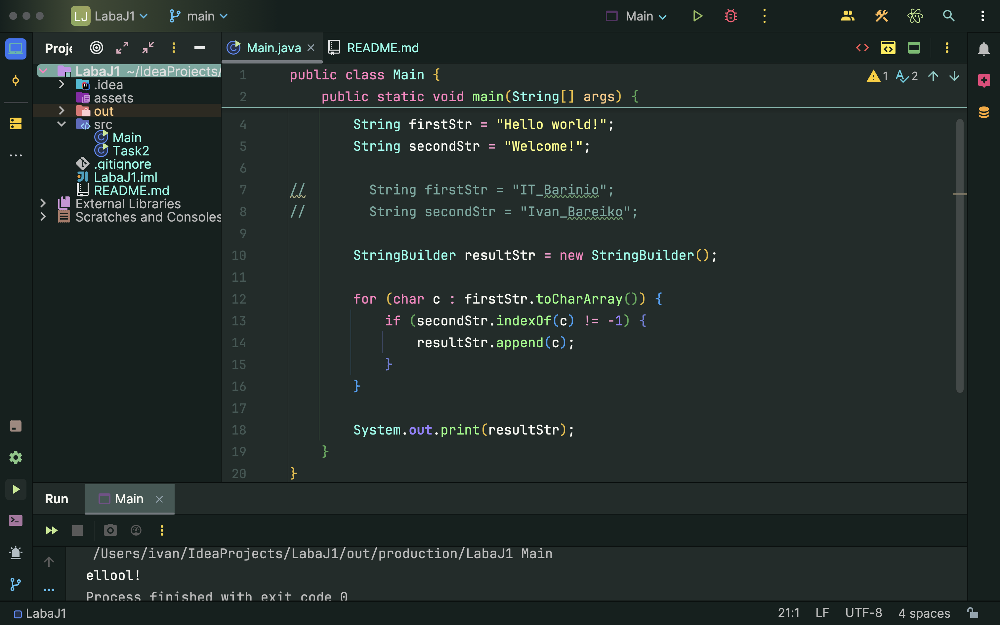

# Лабораторна робота № 1 Робота з рядками у мові Java

## Завдання: 

Задані два рядки. Скласти третій рядок з символів першого рядка, які зустрічаються у другому рядку.

```java
public class Main {
    public static void main(String[] args) {

        String firstStr = "Hello world!";
        String secondStr = "Welcome!";

        // Створюємо об'єкт StringBuilder
        StringBuilder resultStr = new StringBuilder();

        // Завдяки foreach-циклу проходимо по кожному символу в firstStr
        for (char c : firstStr.toCharArray()) {
            // Якщо цей символ є в secondStr, додаємо його до resultStr
            if (secondStr.indexOf(c) != -1) {
                resultStr.append(c);
            }
        }

        System.out.print(resultStr);
    }
}
```

Результат:

